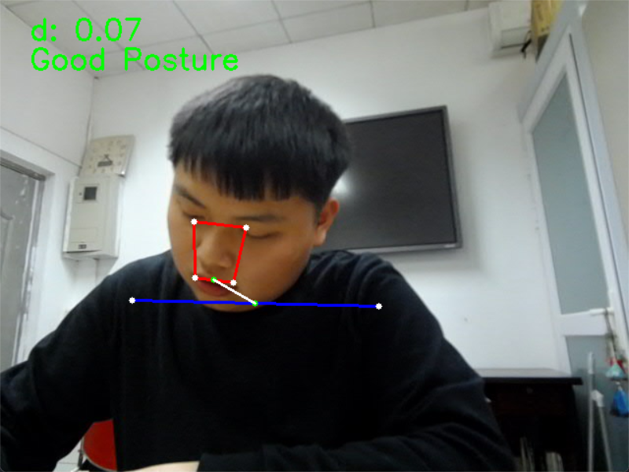
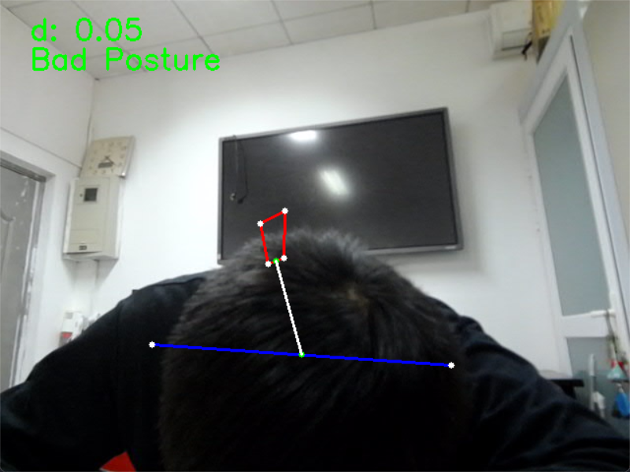
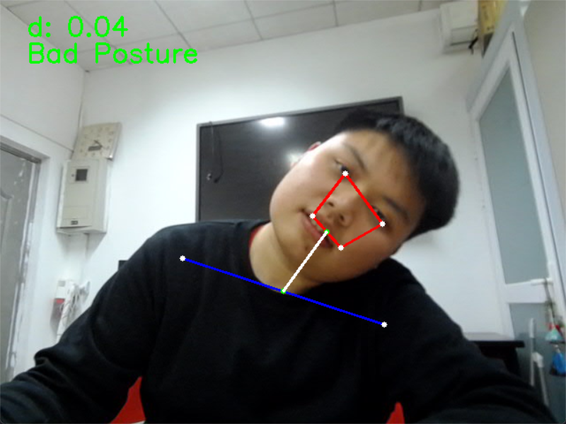
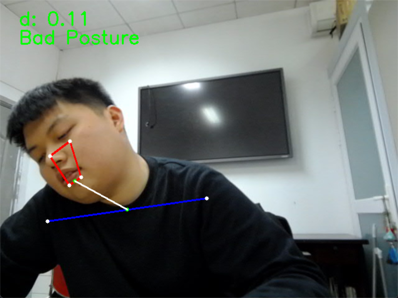

# SitPosture Detection

## 项目简介
SitPosture 是一个基于 OpenCV 和 MediaPipe 的实时姿势检测项目，
它可以检测用户的坐姿，并识别是否出现低头或倾斜等不良姿势。

## 功能概述
- **骨架绘制**：使用 `mediapipe` 提取关键点，并在帧上绘制骨架。
- **低头检测**：计算嘴巴中心与肩膀中心的欧几里得距离，根据阈值判断是否低头。
- **倾斜检测**：通过计算眼睛和耳朵的水平倾斜角度，判断用户是否有歪头现象。
- **实时视频处理**：使用 OpenCV 处理摄像头输入，并在窗口中显示检测结果。

## 代码结构
```
SitPosture/
│── DRAW.py        # 负责绘制骨架、关键点和标签
│── POSTURE.py     # 主程序，进行姿势检测
│── README.md      # 项目说明文档
```

## 依赖环境
在运行项目之前，请确保安装了以下依赖项：

```bash
pip install opencv-python mediapipe
```

## 使用方法
需要确认在 `POSTURE.py` 中，使用的摄像头，如果使用的是笔记本自带的默认摄像头，为 `cap = cv2.VideoCapture(0)` 。
运行 `POSTURE.py` 进行实时姿势检测：

```bash
python POSTURE.py
```

运行后，程序会打开摄像头并开始检测。如果检测到低头或倾斜，窗口中会显示相应提示。

## 退出方式
按下 `q` 键即可退出程序。

## 关键技术说明
### 1. 低头检测
计算嘴巴中心点与肩膀中心点的 3D 欧几里得距离，并通过初始化帧计算阈值。
如果实时距离小于 75% 阈值，则判断为低头。

### 2. 倾斜检测
计算左右眼、左右耳之间的水平倾斜角度。如果两个角度都超过 10°，则判断为倾斜。

## 示例

Good Posture:\


Bad Posture(前倾):\


Bad Posture(左倾):\


Bad Posture(右倾):\



## 参考
- [MediaPipe Pose 官方文档](https://developers.google.com/mediapipe/solutions/vision/pose)
- [OpenCV 官方文档](https://opencv.org/)

## 未来改进
- 进一步优化检测精度，例如增加对不同角度的检测。
- 添加更多姿势检测功能，例如驼背、端肩等。
- 兼容多种摄像头输入，例如视频文件或外部摄像头。

---
本项目旨在提供一个简单易用的姿势检测工具，如有建议或问题，欢迎讨论！

